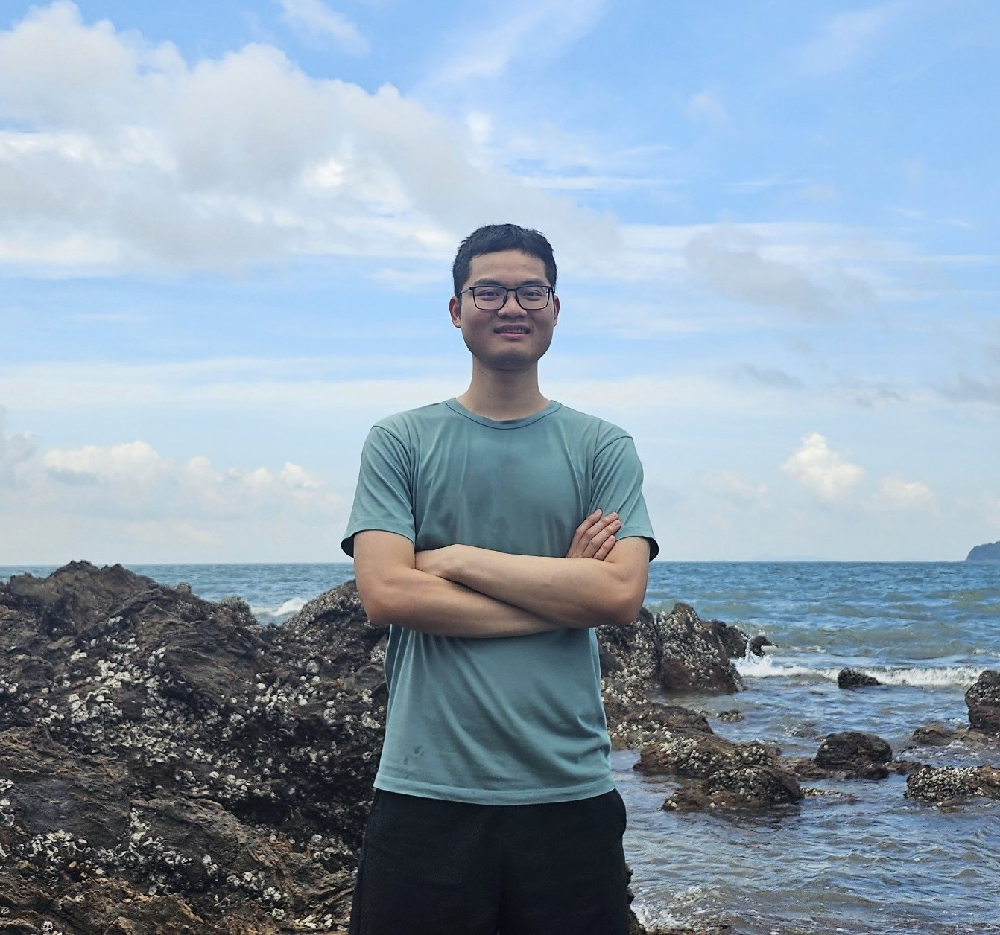

# Trung Vu

Hello! I am a math graduate student at Yale. My advisor is [Ivan Losev](https://ivanloseu.github.io/).

My research interests lie in geometric representation theory, quantum algebras, quantum groups at roots of unity, Soergel bimodules and related objects.

Email: trung.vu@yale.edu

Here is my [CV](TrungCV.pdf).

# Research
- On the functor relating Harish-Chandra bimodules and Soergel bimodules, [arXiv:2507.17067](https://arxiv.org/abs/2507.17067)
- On De Concini-Kac forms of quantum groups (with I.Losev and A.Tsymbaliuk), [arXiv: 2601.06696](https://arxiv.org/abs/2601.06696).

- Quantum Harish-Chandra bimodules at roots of unity. In preparation.

# Teaching
- Math 1150 Calculus II, Spring/Fall 2025. Intructor
- TA/Grader: Calculus, Linear Algebra, Introduction of Differential Manifold.

